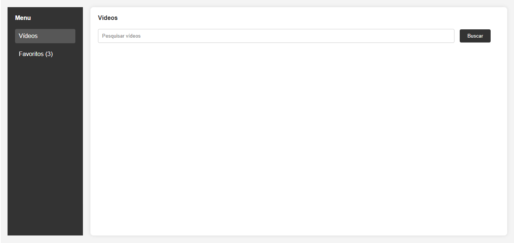
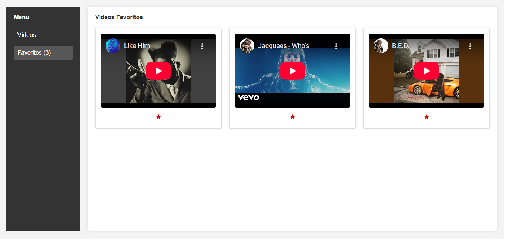
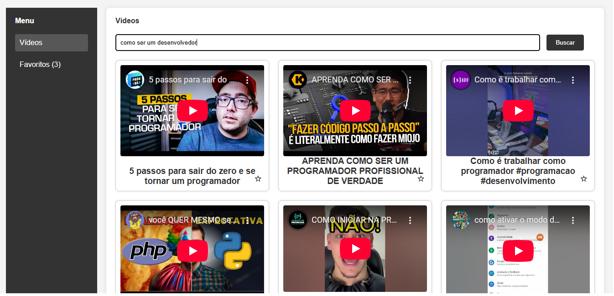

[🇺🇸 English](./README.md)   |   [🇧🇷 Português](./README-pt.md)

<h1 align="center">🧩 YouTube Data Connector</h1>

<p align="center">
	Uma arquitetura modular de micro-frontends para buscar e favoritar vídeos do YouTube, construída com Docker e Webpack Module Federation.
</p>

<p align="center">
  <a href="https://www.docker.com/">
    
  </a>
  <a href="https://www.npmjs.com/">
    
  </a>
  <a href="./LICENSE">
    
  </a>
  
  
  
</p>

---
<a id="visao-geral"></a>
## 🔎 Visão Geral

O **YouTube Data Connector** é um projeto que demonstra **micro-frontends modulares**, permitindo múltiplos módulos independentes que podem ser atualizados e implantados separadamente.  

> 💡 **Por que este projeto é relevante?**  
> Ele mostra como criar uma arquitetura escalável com **Webpack Module Federation** e **Docker**, ideal para grandes times que precisam integrar e atualizar módulos de forma independente, com alta manutenibilidade e baixo acoplamento.

Funcionalidades principais:

- Buscar vídeos do YouTube.
- Favoritar vídeos.
- Navegação fluida entre módulos sem recarregar a aplicação.
- Arquitetura escalável via Docker.
- Integração com APIs externas.

---

## 📑 Sumário
- [Visão Geral](#visao-geral)
- [Demonstração](#demonstracao)
- [Tecnologias](#tecnologias-utilizadas)
- [Como Executar](#como-executar-o-projeto-local)
- [Estrutura do Projeto](#estrutura-do-projeto)
- [Resolução de Problemas](#resolucao-de-problemas)
- [Roteiro](#roteiro-do-projeto)
- [Licença](#licenca)
- [Aprendizados](#aprendizados)
- [Contato](#contato)

---
<a id="demonstracao"></a>
## 🎬 Demonstração

<p align="center">
  
</p>
<p align="center">
  
</p>
<p align="center">
  
</p>


💻 **Deploy ativo:**  
- Frontend: [https://micro-frontends-application.onrender.com/](https://micro-frontends-application.onrender.com/)  

---
<a id="tecnologias-utilizadas"></a>
## 🛠️ Tecnologias Utilizadas

| Camada               | Tecnologias / Ferramentas                 |
|----------------------|--------------------------------------------|
| Frontend             | [React](https://react.dev/), [Angular](https://angular.dev/), [Webpack Module Federation](https://webpack.js.org/concepts/module-federation/) |
| Backend / API        | [Node.js](https://nodejs.org/), [Express](https://expressjs.com/) |
| Containerização      | [Docker](https://www.docker.com/), [Docker Compose](https://docs.docker.com/compose/) |
| Integração & Deploy  | [GitHub Actions](https://github.com/features/actions), [Docker Hub](https://hub.docker.com/) |
| Estilo e UI          | [CSS3](https://developer.mozilla.org/en-US/docs/Web/CSS), [HTML5](https://developer.mozilla.org/en-US/docs/Web/HTML), [Material-UI](https://mui.com/) / [Tailwind](https://tailwindcss.com/) |

---

<a id="como-executar-o-projeto-local"></a>
## 🚀 Como Executar o Projeto (Local)

### ⚙️ Pré-requisitos

Antes de começar, verifique se seu ambiente atende aos seguintes requisitos:

- [](https://developer.mozilla.org/en-US/docs/Web/JavaScript)
- [](https://www.npmjs.com/)
- [](https://www.docker.com/)


### ⬇️ Instalação Rápida
️1️⃣ Clone o repositório
```bash
git clone https://github.com/marcelonovello/YouTube-Data-Connector.git
cd YouTube-Data-Connector
```
2️⃣ Construir e subir com Docker
```bash
docker compose up --build
```
3️⃣ Acessar os micro-frontends
```bash
| Micro-frontend | URL local             |
|----------------|-----------------------|
| Bff            | http://localhost:3000 |
| Drawer         | http://localhost:3001 |
| Video         | http://localhost:3002 |

```

4️⃣ Testar funcionalidades
- Buscar vídeos → no micro-frontend de vídeo
- Favoritar vídeos → no drawer
- Navegação entre módulos → teste links entre os micro-frontends

5️⃣ Parar a Aplicação
```bash
docker compose down
```

---

<a id="estrutura-do-projeto"></a>
## 🏗 Estrutura do Projeto

```sh
└── 📦 Micro-Frontends-Application/          # Pasta raiz do projeto de Micro-Frontends
    ├── 📄 README.md                         # Documentação principal do projeto
    ├── 📂 bff/                               # Serviço Backend-for-Frontend
    │   ├── 📄 Dockerfile                     # Instruções Docker para build do BFF
    │   ├── 📄 __test__                       # Pasta contendo testes do BFF
    │   ├── 📄 babel.config.js                # Configuração do Babel
    │   ├── 📄 jest.config.js                 # Configuração do Jest para testes
    │   ├── 📄 jest.setup.js                  # Scripts de setup do Jest
    │   ├── 📄 package-lock.json              # Versões exatas dos pacotes Node instalados
    │   ├── 📄 package.json                   # Dependências Node e scripts
    │   ├── 📄 public                         # Pasta pública de assets estáticos
    │   └── 📄 server.js                       # Ponto de entrada do servidor BFF
    ├── 📄 docker-compose.yml                 # Configuração do Docker Compose
    ├── 📂 mf_drawer/                          # Micro-frontend do componente drawer
    │   ├── 📄 .env.production               # Variáveis de ambiente de produção
    │   ├── 📄 Dockerfile                     # Instruções Docker para mf_drawer
    │   ├── 📄 babel.config.js                # Configuração do Babel
    │   ├── 📄 favorite.html                  # Página HTML de favoritos
    │   ├── 📄 index.html                     # Página HTML principal
    │   ├── 📄 jest.config.js                 # Configuração do Jest
    │   ├── 📄 jest.setup.js                  # Scripts de setup do Jest
    │   ├── 📄 package-lock.json              # Versões exatas dos pacotes Node instalados
    │   ├── 📄 package.json                   # Dependências Node e scripts
    │   ├── 📄 script.js                      # Lógica JavaScript do drawer
    │   ├── 📄 style.css                      # Estilos do drawer
    │   └── 📄 test                           # Pasta de testes
    ├── 📂 mf_video/                           # Micro-frontend do componente de vídeo
    │   ├── 📄 Dockerfile                     # Instruções Docker para mf_video
    │   ├── 📄 __tests__                      # Pasta contendo testes do vídeo
    │   ├── 📄 babel.config.js                # Configuração do Babel
    │   ├── 📄 dist                            # Pasta de saída do build
    │   ├── 📄 index.html                     # Página HTML principal
    │   ├── 📄 jest.config.mjs                # Configuração do módulo Jest
    │   ├── 📄 jest.setup.js                  # Scripts de setup do Jest
    │   ├── 📄 package-lock.json              # Versões exatas dos pacotes Node instalados
    │   ├── 📄 package.json                   # Dependências Node e scripts
    │   ├── 📄 script.js                      # Lógica JavaScript do vídeo
    │   ├── 📄 style.css                      # Estilos do componente de vídeo
    │   ├── 📄 webpack.config.js              # Configuração do Webpack
    │   └── 📄 {                              # Arquivos adicionais ou placeholder
    └── 📄 package-lock.json                   # Versões exatas dos pacotes Node instalados
```

---

<a id="resolucao-de-problemas"></a>
## 🔧 Resolução de Problemas

- ⚠️ **Se as portas já estiverem em uso** → Altere a porta em `.env` ou `docker-compose.yml`.  
- 🐛 **Se a YouTube API falhar** → Verifique a URL da API ou se o serviço da API está online.  
  
---

<a id="roteiro-do-projeto"></a>
## 🗺 Roteiro do Projeto

- [ ] Autenticação via OAuth do YouTube.
- [ ] Testes unitários e de integração.
- [ ] CI/CD completo com deploy automático.
- [ ] Monitoramento (Sentry, Prometheus).
- [ ] Melhorias visuais e responsividade dos micro-frontends.
- [ ] Documentação detalhada para cada módulo. 

---

<a id="licenca"></a>
## 📄 Licença

Este projeto está licenciado sob a Licença MIT. Consulte o arquivo [LICENSE](LICENSE) para mais detalhes.

---

<a id="aprendizados"></a>
## 📚 Aprendizados

- ⚡ Aplicação prática de Webpack Module Federation.
- 🐳 Uso de Docker para deploy replicável.
- 🛠️ Integração com YouTube Data API.
- 🌐 Boas práticas de Git, commits e documentação.
- 🎨 Aprimoramento em UI/UX e modularização de código.

---

<a id="como-contribuir"></a>
## 🤝 Como Contribuir

Contribuições são bem-vindas! Siga os passos abaixo para colaborar com este projeto:

1. **Faça um Fork** do repositório.  
2. **Crie uma Branch** para sua feature ou correção:  
  ```bash
   git checkout -b minha-feature
  ```
3. Faça as alterações necessárias no código ou na documentação..
4. Confirme as mudanças (commits) com mensagens claras:
  ```bash
  git commit -m "Adiciona nova funcionalidade X"
  ```
5. Envie para seu Fork:
  ```bash
  git push origin minha-feature
  ```
6. Abra um Pull Request (PR) para a branch main deste repositório.
 ```bash
 💡 Dica: Antes de enviar o PR, verifique se o código segue os padrões definidos e se todos os testes passam.
 ```

---

<a id="contato"></a>
## 📬 Contato

- **Autor:** Marcelo Novello  
- **GitHub:** [marcelonovello](https://github.com/marcelonovello)  
- **LinkedIn:** [Marcelo Novello](https://www.linkedin.com/in/marcelo-novello/)  

<p align="center"> ⭐ Se este projeto foi útil, considere deixar uma estrela para apoiar o desenvolvimento! </p>
