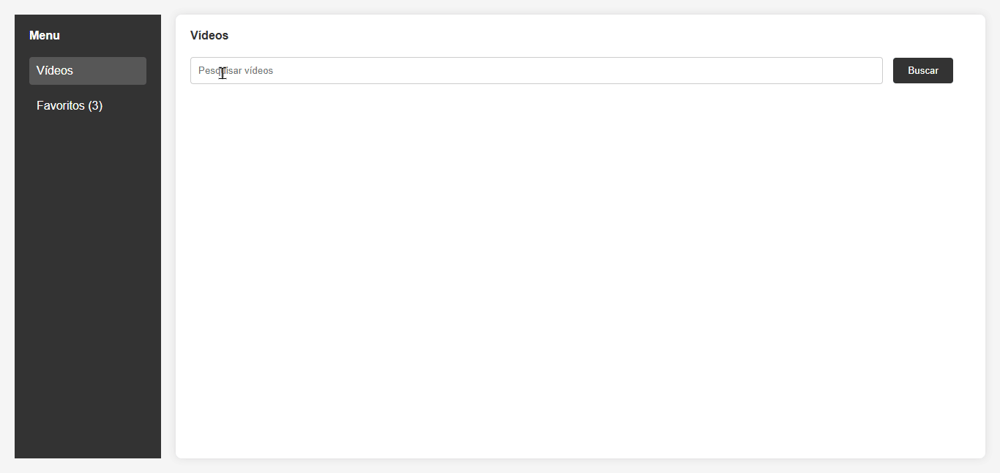

[🇺🇸 English](./README.md)   |   [🇧🇷 Portuguese](./README-pt.md)

<h1 align="center">🧩 YouTube Data Connector</h1>

<p align="center"> Modular micro-frontends architecture (React, Angular) to browse, search, and favorite YouTube videos, with Docker and Webpack Module Federation. </p>

<p align="center">
  <a href="https://www.docker.com/">
    
  </a>
  <a href="https://www.npmjs.com/">
    
  </a>
  <a href="./LICENSE">
    
  </a>
  
  
  
</p>

---

<a id="overview"></a>
## 🔎 Overview

**YouTube Data Connector** demonstrates a **modular micro-frontends** architecture using Webpack Module Federation and Docker, ideal for independent modules that can be updated and deployed separately.

> 💡 **Why is this project relevant?**  
> It allows large teams to integrate and update modules independently, ensuring high maintainability and low coupling.

✨ Key Features
- 🔍 Search YouTube videos
- ⭐ Favorite videos
- 🔄 Smooth navigation between modules
- 🐳 Scalable architecture via Docker
- 🌐 Integration with external APIs

---

<a id="table-of-contents"></a>
## 📑 Table of Contents
- [Overview](#overview)
- [Demo](#demo)
- [Technologies Used](#technologies-used)
- [Local Setup](#how-to-run-the-project-locally)
- [Project Structure](#project-structure)
- [Troubleshooting](#troubleshooting)
- [Testing](#testing)
- [Security](#security)
- [Roadmap](#roadmap)
- [License](#license)
- [Learnings](#learnings)
- [Contributing](#how-to-contribute)
- [Contact](#contact)

---

<a id="demo"></a>
## 🎬 Demo

<p align="center">  </p>

💻 **Live Deploy:**  
- Frontend: [https://micro-frontends-application.onrender.com/](https://micro-frontends-application.onrender.com/)

---

<a id="technologies-used"></a>
## 🛠️ Technologies Used

| Layer                | Technologies / Tools |
|----------------------|-----------------------|
| Frontend             | [React](https://react.dev/), [Angular](https://angular.dev/), [Webpack Module Federation](https://webpack.js.org/concepts/module-federation/) |
| Backend / API        | [Node.js](https://nodejs.org/), [Express](https://expressjs.com/) |
| Containerization     | [Docker](https://www.docker.com/), [Docker Compose](https://docs.docker.com/compose/) |
| Integration & Deploy | [GitHub Actions](https://github.com/features/actions), [Docker Hub](https://hub.docker.com/) |
| UI & Styling         | [CSS3](https://developer.mozilla.org/en-US/docs/Web/CSS), [HTML5](https://developer.mozilla.org/en-US/docs/Web/HTML), [Material-UI](https://mui.com/) / [Tailwind](https://tailwindcss.com/) |

---

<a id="how-to-run-the-project-locally"></a>
## 🚀  Local Setup

### ⚙️ Prerequisites

-  
-  
-  
- **YouTube API Key** in `YOUTUBE_API_KEY` environment variable

### ⬇️ Quick Installation

1️⃣ Clone the repository
```bash
git clone https://github.com/marcelonovello/YouTube-Data-Connector.git
cd YouTube-Data-Connector
```

2️⃣ Build and start with Docker
```bash
docker compose up --build
```

3️⃣ Access the micro-frontends
```bash
Bff: http://localhost:3000 
Drawer: http://localhost:3001 
Video: http://localhost:3002
```
4️⃣ Test functionalities
- 🔍 Search videos → Video micro-frontend
- ⭐ Favorite videos → Drawer
- 🔄 Navigate between modules → links between micro-frontends

5️⃣ Stop the application
```bash
docker compose down
```

---

<a id="project-structure"></a>
## 🏗 Project Structure

```sh
└── 📦 Micro-Frontends-Application/          # Root folder of the Micro-Frontends project
    ├── 📄 README.md                         # Main documentation file of the project
    ├── 📂 bff/                               # Backend-for-Frontend service
    │   ├── 📄 Dockerfile                     # Docker build instructions for the Bff
    │   ├── 📄 __test__                       # Folder containing Bff tests
    │   ├── 📄 babel.config.js                # Babel configuration
    │   ├── 📄 jest.config.js                 # Jest configuration for tests
    │   ├── 📄 jest.setup.js                  # Jest setup scripts
    │   ├── 📄 package-lock.json              # Exact versions of installed Node packages
    │   ├── 📄 package.json                   # Node dependencies and scripts
    │   ├── 📄 public                         # Public folder for static assets
    │   └── 📄 server.js                      # BFF server entry point
    ├── 📄 docker-compose.yml                 # Docker Compose configuration
    ├── 📂 mf_drawer/                          # Micro-frontend for the drawer component
    │   ├── 📄 .env.production                # Production environment variables
    │   ├── 📄 Dockerfile                     # Docker build instructions for mf_drawer
    │   ├── 📄 babel.config.js                # Babel configuration
    │   ├── 📄 favorite.html                  # Favorites HTML page
    │   ├── 📄 index.html                     # Main HTML page
    │   ├── 📄 jest.config.js                 # Jest configuration
    │   ├── 📄 jest.setup.js                  # Jest setup scripts
    │   ├── 📄 package-lock.json              # Exact versions of installed Node packages
    │   ├── 📄 package.json                   # Node dependencies and scripts
    │   ├── 📄 script.js                      # Drawer component JavaScript logic
    │   ├── 📄 style.css                      # Drawer styles
    │   └── 📄 test                           # Test folder
    ├── 📂 mf_video/                           # Micro-frontend for the video component
    │   ├── 📄 Dockerfile                     # Docker build instructions for mf_video
    │   ├── 📄 __tests__                      # Folder containing video component tests
    │   ├── 📄 babel.config.js                # Babel configuration
    │   ├── 📄 dist                           # Build output folder
    │   ├── 📄 index.html                     # Main HTML page
    │   ├── 📄 jest.config.mjs                # Jest module configuration
    │   ├── 📄 jest.setup.js                  # Jest setup scripts
    │   ├── 📄 package-lock.json              # Exact versions of installed Node packages
    │   ├── 📄 package.json                   # Node dependencies and scripts
    │   ├── 📄 script.js                      # Video component JavaScript logic
    │   ├── 📄 style.css                      # Video component styles
    │   ├── 📄 webpack.config.js              # Webpack configuration
    │   └── 📄 {                              # Additional files or placeholder
    └── 📄 package-lock.json                   # Exact versions of installed Node packages

```

---

<a id="troubleshooting"></a>
## 🔧 Troubleshooting
- ⚠️ **If ports are already in use** → change ``PORT`` in ``.env`` or ``docker-compose.yml``.
- 🐛 **If YouTube API fails** → verify your ``YOUTUBE_API_KEY`` is correct and enabled

---

<a id="testing"></a>

## 🧪 Testing
Run unit and integration tests in each micro-frontend:
```bash
  cd mf_video && npm test
```
```bash
  cd ../mf_drawer && npm test
```
```bash
  cd ../bff && npm test
```

---

<a id="security"></a>
## 🔒 Security
- 🔐 Keep dependencies updated using npm audit.
- 🛡️ Enable Dependabot on GitHub to monitor vulnerabilities.
- ❌ Never expose YOUTUBE_API_KEY or other sensitive keys in the repository.

---

<a id="roadmap"></a>
## 🗺 Roadmap

- [X] Micro-frontends architecture implemented
- [ ] YouTube OAuth authentication.
- [ ] Unit and integration tests.
- [ ] Full CI/CD with automatic deploy
- [ ] Monitoring (Sentry, Prometheus).
- [ ] UI/UX improvements and responsiveness.
- [ ] Detailed documentation per module.


---

<a id="license"></a>

## 📄 License
MIT License. See the [LICENSE](LICENSE) file.

---

<a id="learnings"></a>
## 📚 Learnings
- ⚡ Hands-on Webpack Module Federation
- 🐳 Docker for reproducible deployments
- 🛠️ Integration with YouTube Data API
- 🌐 Git best practices, commits, and documentation
- 🎨 UI/UX improvement and code modularization

---

<a id="how-to-contribute"></a>
## 🤝 How to Contribute

Contributions are welcome! Follow these steps:
1. **Fork this repository**.
2. **Create a branch** for your feature or fix:
```bash
   git checkout -b my-feature
```
3. Make your changes.
4. Commit with a clear message:
```bash
   git commit -m "Add feature X"
```
5. Push to your fork:
```bash
   git push origin my-feature
```
6. Open a Pull Request to main.
```bash
💡 Tip: Before submitting, ensure code follows standards and tests pass.
```

---

<a id="contact"></a>

## 📬 Contact
- **Author:** Marcelo Novello
- **GitHub:** [marcelonovello](https://github.com/marcelonovello)  
- **LinkedIn:** [Marcelo Novello](https://www.linkedin.com/in/marcelo-novello/)

---
